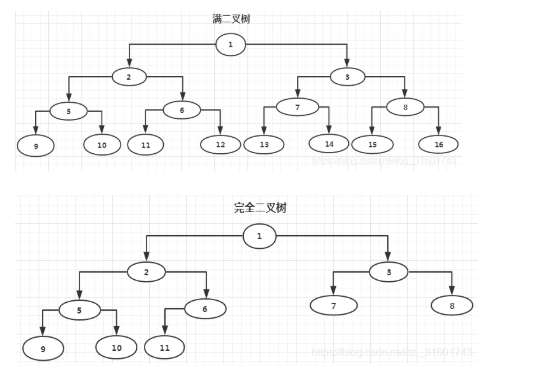

# 数据结构

数据结构分为八大类：

数组、链表、树、栈、队列、堆、图、Hash表。

## 一、数组

特点：连续的内存空间，大小预先固定，不利于扩展。

优点：查找效率高，如果我们做查找，可以直接根据下标能找到数据。

缺点：插入和删除效率低，需要前移后移。

## 二、链表

特点：不连续的内存空间，利于扩展

优点：插入删除效率高。

缺点：不能随机查找，必须从第一个节点开始遍历。

### 2.1 单链表

### 2.2 双向链表

### 2.3 循环链表

## 三、树

### 3.1 什么是树

- 树是一种递归数据结构，包含一个或多个数据节点的集合，其中一个节点被指定为树的根，其余节点被称为根的子节点。

- 除根节点以外的其他节点均被划分为多个非空集，其中每个空集都称为子树。

- 树的节点或者在它们之间保持父子关系，或者它们是姐妹节点。

- 在一般树中，一个节点可以有任意数量的子节点，但只能有一个父节点。

- 下图显示了一棵树，其中节点A是树的根节点，而其他节点可以视为A的子节点。

  

### 3.2 基本术语

- **根节点** ：-根节点是树层次结构中的最高节点。 换句话说，**根节点是没有任何父节点的节点**。
- **子树** ：-如果根节点不为空，则树`T1`，`T2`和`T3`被称为根节点的子树。
- **叶子节点** ：-没有任何子节点的树的节点称为叶子节点。 **叶节点是树的最底部节点**。 普通树中可以有任意数量的叶节点。 叶节点也可以称为外部节点。
- **路径** ：-连续边的顺序称为路径。 在上图所示的树中，到节点E的路径为`A→B→E`。
- **祖先节点** ：- 节点 的祖先是从根到该节点的路径上的**任何前任节点**。 根节点没有任何祖先。 在上图所示的树中，节点F具有祖先B和A。
- **节点的度** ：-节点的度等于一个节点具有的子代数。 在上图所示的树中，节点B的度为2。叶节点的度始终为0，而在完整的二叉树中，每个节点的度等于2。整个树的度等于所有节点度的最大值。
- **等级号** ：-树的每个节点被分配一个等级号，使得每个节点都比其父级高一个等级。 树的根节点始终位于级别0。
- **节点的深度：**从根节点到当前节点的唯一路径上的节点总数。树的深度为所有节点深度中的最大值。
- **节点的高度：**从当前节点到最远叶子节点的路径上的节点总数。树的高度为所有节点高度中的最大值。树的深度等于树的高度。

+ **先序遍历**：根–左–右 （根在前）

+ **中序遍历**：左–根–右 （根在中）

+ **后序遍历**：左–右–根 （根在后）

  

### 3.3 树的分类

#### 3.3.1、普通树（General Tree）

节点可以包含任意多个子树，每个节点包含3个子树的称为3叉树，每个节点包含N个子树的称为N叉树。

#### 3.3.2、二叉树（Binary Tree）

[如何写递归](https://lyl0724.github.io/2020/01/25/1/)

#### 3.3.3、真二叉树（Proper Binary Tree）

所有节点的度都要么为0，要么为2。

下图的树不是真二叉树，因为3号节点的度为1.

#### 3.3.4 满二叉树（Full Binary Tree）

所有节点的度要么为0，要么为2，对于树的高度为K，节点个数为2^k - 1的二叉树。例如：

#### 3.3.5 完全二叉树（Complete Binary Tree）

叶子节点只会出现在最后2层，且最后一层的叶子节点都靠左对齐。

简单来说，就是所有节点从上往下，从左往右依次排列。

- 完全二叉树从根节点到倒数第2层是一棵满二叉树
- 满二叉树一定是完全二叉树，完全二叉树不一定是满二叉树
- 度为1的节点只有左子树
- 度为1的节点要么是1个，要么是0个
- 同样节点数量的二叉树，完全二叉树的高度最小

#### 3.3.6 二叉搜索树（Binary Search Tree）

又叫二叉排序树，若它的左子树不空，则左子树上所有结点的值均小于它的根节点的值； 若它的右子树不空，则右子树上所有结点的值均大于它的根结点的值； 它的左、右子树也分别为二叉排序树。

#### 平衡二叉树（AVL树）

左子树右子树高差<=1，插入和删除节点后，需要频繁的左旋右旋。

高度控制严格，查找效率会高

### 红黑树（Red-Black Tree）

根节点和叶子节点为黑节点，左子树右子树的黑高一致。

高度控制不那么严格，所以插入，删除后自旋的频率低，效率提高。但查询会比AVL树低。

##### 应用场景

#### B-树（B Tree）

读作B树，中间为横杠，非B减树。

##### 应用场景

#### B+树（B+ Tree）

##### 应用场景