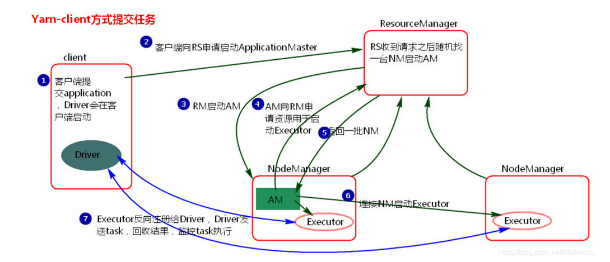
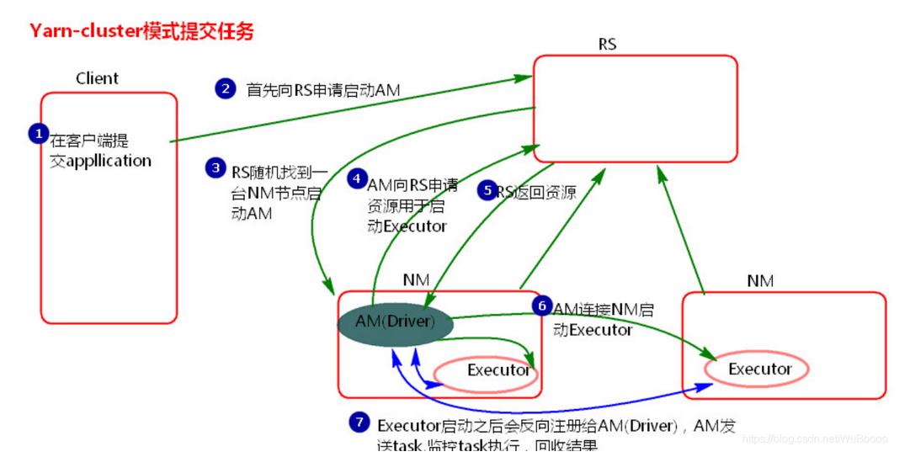

## 一、HDFS

### HDFS适合场景

 1、存储大文件场景

 2、一次写入，多次读出分析的场景

 3、数据增长非常快的，HDFS可以横向扩展

 4、HDFS有副本机制，可以提高数据的安全性。

### HDFS不适合场景

 1、存储小文件，因为小文件太多，HDFS的namenode中的元数据也会越多。而元数据存在内存中，占用过多内存。

 2、对延迟要求高的，HDFS不适合毫秒级的数据访问。

 3、对文件进行多次写入修改的。HDFS只支持文件的追加，不支持修改。

### HDFS中几个角色

#### 1、Client 客户端

+ 文件切分，文件写入HDFS时，Client将文件切分成一个一个的Block，然后进行存储。
+ 与NameNode交互，获取文件的位置信息
+ 与DataNode交互，读取写入数据	

#### 2、NameNode 管理节点

+ 存储元数据信息，一个文件被切成了几个block，有几个副本，每个block大小以及存放DataNode的位置信息。维护一个block块列表
+ 处理客户端读写请求
+ 定期把内存中的元数据写入到fsimage镜像中，fsimage在启动时会被加载到内存与editlog操作日志合并。

#### 3、DataNode 数据节点

+ 具体的读写操作
+ 汇报心跳、定期汇报自己的数据块信息、以及数据库缓存信息（某个block块经常被访问，就将块缓存到内存中）。

#### 4、Secondary NameNode

+ 辅助NameNode，分担工作量

> 扩展: 机架感知：默认block块128M，3个副本。机架rack，将副本存储到不同机架上。


### HDFS读写流程

#### 写流程

1. Client请求上传文件
2. nameNode检查上传权限（权限以及文件相关检查，文件是否已经存在）
3. nameNode返回Client可以上传。
4. Client将文件进行切分blk块，向nameNode请求上传blk1，（假设有blk1，blk2，blk3）
5. nameNode根据集群中的dn上的blk信息和机架信息，选出可以上传的3个主机（datanode1，2，3），来存储blk1。
6. namenode把datanode列表返回给Client。
7. Client和DataNode建立pipeline。（Client连接dn1，dn1连接dn2，dn2连接dn3.）
8. Client将blk1划分为packet（64k）通过socket流传给dn1，dn1通过pipeline传给dn2，（划分为packet的好处是，可以像水管流水一样不停的传数据，提高效率）
9. 每个节点都会将packet信息缓存起来，然后写入文件。
10. 写入文件后，发送应答ACK。后一个节点往前一个节点发应答，最后告诉Client，这个packet传送完成。
11. 第一个blk的所有packet传完后，给Client回应，Client继续传第二个blk。


#### 读流程

1. Client向nameNode请求，读取文件。
2. nameNode对客户端以及文件进行权限检查，然后根据策略选出合适的blk所在的datanode（blk1：dn1，dn3，dn4）（blk2：dn2，dn3，dn4）。
3. 返回给客户端该文件的block列表。客户端就知道去哪个datanode去找相应的blk。
4. Client和对应的datanode分别建立pipeline。
5. 读取的时候，并行执行，按照pipeline的packet读到客户端。
6. 客户端将三个blk合并为完整文件。

### 元数据管理

#### fsimage 元数据镜像

fsimage是一段时间内元数据的快照。

#### edits 操作日志

edits是最近一段时间的操作日志。

fsimage + edits 才是完整的内存中的元数据信息。  （重启的时候会加载fsimage+edits）

考虑一个问题：如果namenode一直不重启，edits会越来越多越来越大。

需要引入secondaryNameNode，隔一段时间将fsimage + edits拷贝过来（触发条件：隔一个小时，或者editlog达到64M的时候）。

在secondaryNameNode合并后生成新的fsimage，然后拷贝给namenode。


## 二、YARN

YARN是一个资源调度平台，负责为运算程序提供服务器运算资源，相当于一个分布式的操作系统平台，而MapReduce等运算程序则相当于运行于操作系统之上的应用程序。

Yarn是Hadoop2.x版本中的一个新特性。它的出现其实是为了解决第一代MapReduce编程框架的不足，提高集群环境下的资源利用率，这些资源包括内存，磁盘，网络，IO等。Hadoop2.x版本中重新设计的这个Yarn集群，具有更好的扩展性，可用性，可靠性，向后兼容性，以及能支持除MapReduce以外的更多分布式计算程序。

一句话就是，Yarn有两个功能，资源管理以及作业监控。

不仅仅MR可以运行在Yarn上，Spark和其他的一些计算也可以运行在Yarn上，生产上常见的运作模式。

### ResourceManager

​	简称RM，是YARN资源控制框架的中心模块，负责集群中所有的资源的统一管理和分配。它接收来自NM(NodeManager)的汇报，给ApplicationMaster分配空闲的Container来运行ApplicationMaster。ResourceManager主要有两部分组成：

+ **调度器（Scheduler）**：根据各个NodeManager的资源情况进行资源分配，分配Container。
+ **应用程序管理器（Applications Manager）**：管理所有的应用程序，比如同时提交的两个不同的作业，分别会启动两个不同的ApplicationMaster来管理监控各自的作业情况。

### NodeManager

​	简称NM，NodeManager是ResourceManager在每台机器的上代理，负责容器的管理，并监控他们的资源使用情况（cpu，内存，磁盘及网络等），以及向 ResourceManager提供这些资源使用报告。接收并处理来自ApplicationMaster的启动/停止Container请求。

### ApplicationMaster

简称AM。YARN中每个应用，比如Client每提交一个作业，都会启动一个AM，负责向RM申请资源，请求NM启动container，并告诉container做什么事情。

每个作业只会启动一个AM，这个AM启动在某一个NM上。

### Container

资源容器，YARN中所有的应用都是在container之上运行的。AM也是在container上运行的，不过AM的container是RM申请的。

  （1）  Container是YARN中资源的抽象，它封装了某个节点上一定量的资源（CPU和内存两类资源）。

  （2） Container由ApplicationMaster向ResourceManager申请的，由ResouceManager中的资源调度器异步分配给ApplicationMaster；

   （3）Container的运行是由ApplicationMaster向资源所在的NodeManager发起的，Container运行时需提供内部执行的任务命令（可以是任何命令，比如java、Python、C++进程启动命令均可）以及该命令执行所需的环境变量和外部资源（比如词典文件、可执行文件、jar包等）。

**一个应用程序所需的Container分为两大类，如下：**

+ **运行ApplicationMaster的Container**：这是由ResourceManager（向内部的资源调度器）申请和启动的，用户提交应用程序时，可指定唯一的ApplicationMaster所需的资源；

+ **运行各类任务的Container**：这是由ApplicationMaster向ResourceManager申请的，并由ApplicationMaster与NodeManager通信以启动之。

以上两类Container可能在任意节点上，它们的位置通常而言是随机的，即ApplicationMaster可能与它管理的任务运行在一个节点上。

### 任务调度流程

1. Client提交计算任务给ResourceManager

2. ResourceManager检查权限以及集群资源情况，然后选择1个NodeManager启动Container，在Container启动ApplicationMaster。

3. ApplicationMaster启动后向ResourceManager的ApplicationsManager注册（这时候ResourceManager就能监控到ApplicationMaster了。）

4. ApplicationMaster向ResourceManager的Scheduler申请计算资源。

5. Scheduler回复ApplicationMaster资源列表，可以在哪些NodeManager在启动多个Container。

6. Applications根据资源列表去找NodeManager，让NodeManager分配资源启动Container

7. Contanier运行MapTask和ReduceTask，执行计算任务。

8. Contanier向ApplicationMaster汇报任务执行情况。

9. ApplicationMaster再向ApplicationsManager汇报执行情况。

10. ApplicationManager返回给客户端执行情况。

    
    
    

### Spark on Yarn

#### Yarn-client方式




执行流程：

1.客户端提交一个Application，在客户端启动一个Driver进程。

2.Driver进程会向RS(ResourceManager)发送请求，启动AM(ApplicationMaster)。

3.RS收到请求，随机选择一台NM(NodeManager)启动AM。这里的NM相当于Standalone中的Worker节点。

4.AM启动后，会向RS请求一批container资源，用于启动Executor。

5.RS会找到一批NM返回给AM,用于启动Executor。
 AM会向NM发送命令启动Executor。

6.Executor启动后，会反向注册给Driver，Driver发送task到Executor,执行情况和结果返回给Driver端。

#### Yarn-cluster方式



执行流程：

1.客户机提交Application应用程序，发送请求到RS(ResourceManager),请求启动AM(ApplicationMaster)。

2.RS收到请求后随机在一台NM(NodeManager)上启动AM（相当于Driver端）。

3.AM启动，AM发送请求到RS，请求一批container用于启动Executor。

3.RS返回一批NM节点给AM。

4.AM连接到NM,发送请求到NM启动Executor。

5.Executor反向注册到AM所在的节点的Driver。Driver发送task到Executor。

#### 小结

Yarn-client模式同样是适用于测试，因为Driver运行在本地，Driver会与yarn集群中的Executor进行大量的通信，会造成客户机网卡流量的大量增加.

Yarn-Cluster主要用于生产环境中，因为Driver运行在Yarn集群中某一台nodeManager中，每次提交任务的Driver所在的机器都是随机的，不会产生某一台机器网卡流量激增的现象，缺点是任务提交后不能看到日志。只能通过yarn查看日志。

### Yarn调度器

当多个作业任务需要执行时，需要Yarn进行调度，有3种调度策略。

+ 队列调度器 FIFO Scheduler
  + 问题：大任务可能占用整个集群，导致小任务阻塞。所以用的比较少。
+ 容量调度器 Capacity Scheduler （默认）
  + 有多个任务队列
  + 根据每个任务的体量以及当前机器的剩余资源情况，按比例分配资源。
+ 公平调度器Fair Scheduler
  + 如果当前只有1个任务，则独占所有资源。当现在有两个任务，则将资源平分。

## 三、MR

MapReduce就是分布式分治的思想。Map分，Reduce来合。MR能做什么？统计，去重，排序，清洗（业务关注的数据，此时不需要reduce，只需要map）

经典案例，WordCount单词统计。5个步骤：


​				**注意**：上图 Block和split是不一样的！有多少个split就有多少个mapTask。[split与block的区别与联系](https://blog.csdn.net/llc1984513/article/details/79020289)

1. **输入分片（input split）：**在进行map计算之前，mapreduce会根据输入文件计算输入分片（input split），每个输入分片（input split）针对一个map任务，输入分片（input  split）存储的并非数据本身，而是一个分片长度和一个记录数据的位置的数组，输入分片（input  split）往往和hdfs的block（块）关系很密切，假如我们设定hdfs的块的大小是64mb，如果我们输入有三个文件，大小分别是3mb、65mb和127mb，那么mapreduce会把3mb文件分为一个输入分片（input split），65mb则是两个输入分片（input split）而127mb也是两个输入分片（input  split），换句话说我们如果在map计算前做输入分片调整，例如合并小文件，那么就会有5个map任务将执行，而且每个map执行的数据大小不均，这个也是mapreduce优化计算的一个关键点。

   ```Bash
   #原始文件
   chenyu xiaohei xiaosan
   xiaoming wangwu
   xiaoming chenyu
   ```

   ```bash
   #InputFormat （读一行就开始调用一次map类的方法）
   
   keyIn						ValueIn
   行首字母偏移量0				chenyu xiaohei xiaosan
   23							xiaoming wangwu
   39							xiaoming chenyu
   ```

   

2. **map**阶段：就是程序员编写好的map函数了，因此map函数效率相对好控制，而且一般map操作都是本地化操作也就是在数据存储节点上进行；

   ```bash
   #Map局部计算
   KeyIn					ValueIn
   0						chenyu xiaohei xiaosan
   23						xiaoming wangwu
   39						xiaoming chenyu
   
   #业务代码
   String.split("空格")
   
   KeyOut					ValueOut
   chenyu					1
   xiaohei					1	 
   xiaosan					1	 
   xiaoming				1
   wangwu					1
   xiaoming				1
   chenyu					1
   ```

   

3. **shuffle**阶段：将map的输出作为reduce的输入的过程就是shuffle了，这个是mapreduce优化的重点地方。Shuffle一开始就是map阶段做输出操作，一般mapreduce计算的都是海量数据，map输出时候不可能把所有文件都放到内存操作，因此map写入磁盘的过程十分的复杂，更何况map输出时候要对结果进行排序，内存开销是很大的，map在做输出时候会在内存里开启一个环形内存缓冲区，这个缓冲区专门用来输出的，默认大小是100mb，并且在配置文件里为这个缓冲区设定了一个阀值，默认是0.80（这个大小和阀值都是可以在配置文件里进行配置的），同时map还会为输出操作启动一个守护线程，如果缓冲区的内存达到了阀值的80%时候，这个守护线程就会把内容写到磁盘上，这个过程叫spill，另外的20%内存可以继续写入要写进磁盘的数据，写入磁盘和写入内存操作是互不干扰的，如果缓存区被撑满了，那么map就会阻塞写入内存的操作，让写入磁盘操作完成后再继续执行写入内存操作，前面我讲到写入磁盘前会有个排序操作，这个是在写入磁盘操作时候进行，不是在写入内存时候进行的，如果我们定义了combiner函数，那么排序前还会执行combiner操作。每次spill操作也就是写入磁盘操作时候就会写一个溢出文件，也就是说在做map输出有几次spill就会产生多少个溢出文件，等map输出全部做完后，map会合并这些输出文件。这个过程里还会有一个Partitioner操作，对于这个操作很多人都很迷糊，其实Partitioner操作和map阶段的输入分片（Input  split）很像，一个Partitioner对应一个reduce作业，如果我们mapreduce操作只有一个reduce操作，那么Partitioner就只有一个，如果我们有多个reduce操作，那么Partitioner对应的就会有多个，Partitioner因此就是reduce的输入分片，这个程序员可以编程控制，主要是根据实际key和value的值，根据实际业务类型或者为了更好的reduce负载均衡要求进行，这是提高reduce效率的一个关键所在。到了reduce阶段就是合并map输出文件了，Partitioner会找到对应的map输出文件，然后进行复制操作，复制操作时reduce会开启几个复制线程，这些线程默认个数是5个，程序员也可以在配置文件更改复制线程的个数，这个复制过程和map写入磁盘过程类似，也有阀值和内存大小，阀值一样可以在配置文件里配置，而内存大小是直接使用reduce的tasktracker的内存大小，复制时候reduce还会进行排序操作和合并文件操作，这些操作完了就会进行reduce计算了。

   + 分区：Partitioner 按单词长度分区

     + 如果是多个ReduceTask，为了解决多个MapTask的数据交给哪一个ReduceTask，就引入了Shuffle中的分区Partitioner概念。一个分区对应一个ReduceTask。分区解决的是map执行结果分配到哪个具体的Reduce处理
     + 为了解决map的局部数据在传递给多个reduce处理过程中，为了保证每个reduce处理的数据均衡，引入了分区的概念。shuffle分区算法默认使用Hash分区，拿map中的每一条数据取mod，mod到对应的reduceTask。

     + 可以设置多个reduceTask，但MapTask的个数不能手动设定。

     + 设置reduceTask可以提高reduce效率，但设置了多个reduceTask，那么结果会根据reduceTask的数量放入不同文件中。

     > ```java
     > //不使用hash分区，可以自定义分区算法，
     > package pation;
     > 
     > import org.apache.hadoop.io.NullWritable;
     > import org.apache.hadoop.io.Text;
     > import org.apache.hadoop.mapreduce.Partitioner;
     > 
     > public class PationOwn extends Partitioner<Text, NullWritable> {
     > @Override
     > public int getPartition(Text text, NullWritable nullWritable, int i) {
     >     String[] split = text.toString().split("\t");
     >         //大于7的，分到分区0，小于7的分到分区1，(假设现在只有两个reduceTask，也就只有两个分区)
     >     return Integer.parseInt(split[0]) > 7 ? 0 : 1 ;
     >    }
     > ```
     
     ```bash
     
     ```
     

     
   + 排序：按单词长度排序，或者按照字典序排序
   
  ```Bash
     #Shuffle排序   （按字典序），等所有的mapTask都执行完，进行shuffle
  chenyu					1
     chenyu					1
  wangwu					1
     xiaohei					1	 	 
     xiaoming				1
     xiaoming				1
     xiaosan					1
  ```

​     

   + **Combiner**：MapTask阶段将相同的数据规约在一起，相当于每个节点先局部汇总，然后再发给ReduceTask。减少网络传输，提高性能和效率。比如chenyu 1 和 chenyu 1 规约成 chenyu 2再发给ReduceTask。（Combiner的父类就是Reducer，是发生在map端的一个小型的reduce）

  combiner阶段是程序员可以选择的，combiner其实也是一种reduce操作，因此我们看见WordCount类里是用reduce进行加载的。Combiner是一个本地化的reduce操作，它是map运算的后续操作，主要是在map计算出中间文件前做一个简单的合并重复key值的操作，例如我们对文件里的单词频率做统计，map计算时候如果碰到一个hadoop的单词就会记录为1，但是这篇文章里hadoop可能会出现n多次，那么map输出文件冗余就会很多，因此在reduce计算前对相同的key做一个合并操作，那么文件会变小，这样就提高了宽带的传输效率，毕竟hadoop计算力宽带资源往往是计算的瓶颈也是最为宝贵的资源，但是combiner操作是有风险的，使用它的原则是combiner的输入不会影响到reduce计算的最终输入，例如：如果计算只是求总数，最大值，最小值可以使用combiner，但是做平均值计算使用combiner的话，最终的reduce计算结果就会出错。

+ 分组:
  
  ```bash
     #Shuffle分组
  chenyu					[1,1]
     wangwu					[1]
  xiaohei					[1]	 	 
     xiaoming				[1,1]
     xiaosan					[1]
  ```
  
   > 环形缓冲区：
   >
   > 当有大量数据的时候，我们不能存储所有的数据，那么计算机处理数据的时候，只能先处理先来的，那么处理完后呢，就会把数据释放掉，再处理下一个。那么，已经处理的数据的内存就会被浪费掉。因为后来的数据只能往后排队，如过要将剩余的数据都往前移动一次，那么效率就会低下了，肯定不现实，所以，环形队列就出现了。
   >
> 目的：避免频繁的内存创建取消、分配。内存一直只用了一块。
   >
   > MapTask将Map结果不断写入到环形缓冲区中，相当于生产者。另一个线程不断的读缓冲区的内容到磁盘上，相当于消费者。到达阈值是80%，消费者开始溢写到磁盘，此时MapTask可以继续输出数据到内存。如果此时生产过快，到了100%，则阻塞，等待消费完成。

4. **reduce**阶段：和map函数一样也是程序员编写的，最终结果是存储在hdfs上的。

   > job counter: 用来对map执行的次数和reduce执行的次数计数器。
   
   ```bash
   #reduce的输入   （shuffle每输出一行，reduce阶段就调用reduce一次！）
   chenyu					[1,1]
   wangwu					[1]
   xiaohei					[1]	 	 
   xiaoming				[1,1]
   xiaosan					[1]
   
   #业务代码
   for(map.iter)
   	value.sum++;
   #Reduce阶段 汇总计算  
   chenyu					2
   wangwu					1
   xiaohei					1 	 
   xiaoming				2
	xiaosan					1
   ```
   
   


