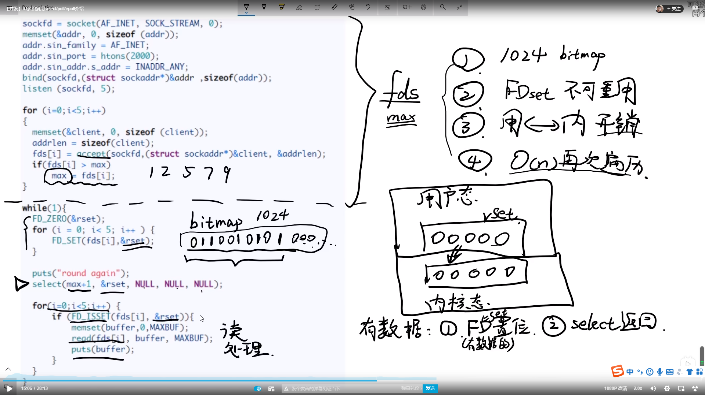
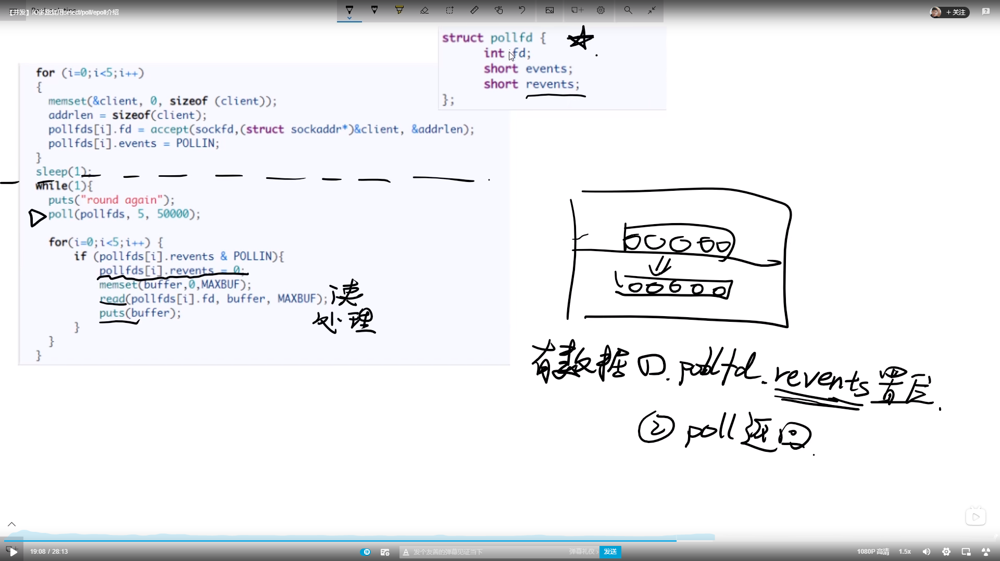
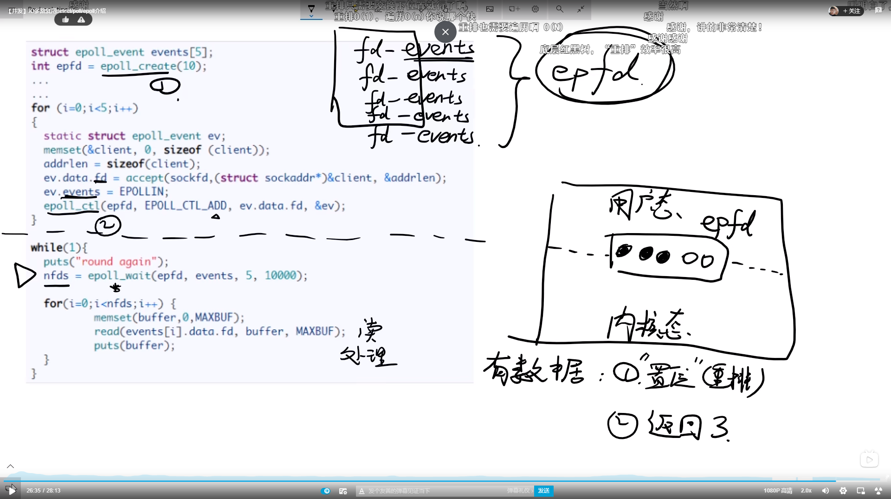

-------------------------------------------------------------------------------------------------------------------
# Linux基础

## Linux几大子系统

Linux内核主要由5个子系统组成，分别是进程调度（SCHED）、内存管理（MM）、虚拟文件系统（VFS）、网络接口（NET）和进程间通信（IPC）。

> 1、内存管理 
> 内存管理主要完成的是如何合理有效地管理整个系统的物理内存，同时快速响应内核各个子系统对内存分配的请求。Linux内存管理支持虚拟内存，而多余出的这部分内存就是通过磁盘申请得到的，平时系统只把当前运行的程序块保留在内存中，其他程序块则保留在磁盘中。在内存紧缺时，内存管理负责在磁盘和内存间交换程序块。

------

> 2、进程管理 
> 进程管理主要控制系统进程对CPU的访问。当需要某个进程运行时，由进程调度器根据基于优先级的调度[算法](http://lib.csdn.net/base/31)启动新的进程。：Linux支持多任务运行，那么如何在一个单CPU上支持多任务呢？这个工作就是由进程调度管理来实现的。在系统运行时，每个进程都会分得一定的时间片，然后进程调度器根据时间片的不同，选择每个进程依次运行，例如当某个进程的时间片用完后，调度器会选择一个新的进程继续运行。由于切换的时间和频率都非常的快，由此用户感觉是多个程序在同时运行，而实际上，CPU在同一时间内只有一个进程在运行，这一切都是进程调度管理的结果。

------

> 3、进程间通信 
> 进程间通信主要用于控制不同进程之间在用户空间的同步、数据共享和交换。由于不用的用户进程拥有不同的进程空间，因此进程间的通信要借助于内核的中转来实现。一般情况下，当一个进程等待硬件操作完成时，会被挂起。当硬件操作完成，进程被恢复执行，而协调这个过程的就是进程间的通信机制。

------

> 4、虚拟文件系统 
> Linux内核中的虚拟文件系统用一个通用的文件模型表示了各种不同的文件系统，这个文件模型屏蔽了很多具体文件系统的差异，使Linux内核支持很多不同的文件系统，这个文件系统可以分为逻辑文件系统和设备驱动程序：逻辑文件系统指Linux所支持的文件系统，例如ext2、ext3和fat等；设备驱动程序指为每一种硬件控制器所编写的设备驱动程序模块。

------

> 5、网络接口 
> 网络接口提供了对各种网络标准的实现和各种网络硬件的支持。网络接口一般分为网络协议和网络驱动程序。网络协议部分负责实现每一种可能的网络传输协议。网络设备驱动程序则主要负责与硬件设备进行通信，每一种可能的网络硬件设备都有相应的设备驱动程序。

### 进程间的通信方式

0号进程->1号内核进程->1号用户进程（init进程）->getty进程->shell进程

### 如何制作linux发行版

1、做一些准备工作，比如选择选择合适的linux宿主机。准备基础工具集，比如gcc，make汇编等工具链源码包。然后linux系统需要的最小软件包集合minimal，bash，网络管理工具等等，还有选好内核。
2、构建都是在宿主机上进行的，创建独立的分区和文件系统，通过宿主机编译gcc，make汇编等工具链。
3、使用chroot，创建根目录下的文件夹，准备好内核，并根据之前构建的工具集合把minimal中的包都编译一遍，放入指定的目录，比如很多编译好的工具需要放到bin目录，或者sbin目录。
4、接下来做配置工作，包括网络配置、时钟设置，本地化设置，/etc下面的很多配置，systemd配置。
5、最后做启动的配置，/etc/fstab挂载点，grub2启动引导。
6、基本的系统起来后，你可以做一些个性化的工作，比如你更关注虚拟化，可以集成相关虚拟化的软件，你喜欢桌面，可以集成桌面相关的包，比如x-server，KDE，mate，gnome

Hang机解决：首先判断是真死机还是假死机。比如服务器提供的服务不可用了，无法访问。
直接登录服务器，如果能登录，进去查看资源使用情况，比如top的cpu占用，内存使用，磁盘使用。
查看网络以及磁盘io的情况。是不是请求太多，io阻塞了。Top 查看cpu有90以上wait，很可能就是io阻塞造成的。
使用一些工具比如iostat查看io使用情况，查看是哪个进程占用较高，查看是哪些文件的读写较高，一步一步找到问题。

### 国产化ARM平台

ARM 3中授权，架构授权，你可以修改指令集，对整个架构进行改造。飞腾就是这一级授权。
             内核授权，将arm核心用到自己设计的芯片中，可以扩展，但不能改arm核心。
             使用授权，使用已经封装好的arm芯片。

# 云计算

-------------------------------------------------------------------------------------------------------------------
### kvm与xen区别

1、kvm全虚拟化，xen半虚拟化
kvm是集成到内核中的一个动态模块，kvm.ko。需要硬件支持，比如intel和amd的cpu虚拟化支持。
xen的话，没有被集成到内核中，因此需要改造我们的内核，xen是可以直接运行在我们的硬件之上的。然后在xen的hypervisor之上运行我们的domain-0超级管理员。管理我们的虚拟机domain1-N。
而kvm全虚拟化，是把虚拟机完全的当成一个主机来运行的，运行在支持kvm内核的os之上。

-------------------------------------------------------------------------------------------------------------------
### qemu

qemu是一套虚拟化解决方案，他可以虚拟出不同架构上的cpu，kvm只是内核模块，在核外的管理工具就是使用的改造后的qemu，

-------------------------------------------------------------------------------------------------------------------
### KVM-Qemu-Libvirt联系

在所谓的kvm技术中，应用到的其实有2个东西：qemu+kvm
kvm负责cpu虚拟化+内存虚拟化，但kvm不能模拟其他设备；
qemu是模拟IO设备（网卡，磁盘），kvm加上qemu之后就能实现真正意义上服务器虚拟化。
因为用到了上面两个东西，所以一般都称之为qemu-kvm。
libvirt则是调用kvm虚拟化技术的接口用于管理的，用libvirt管理方便，直接用qemu-kvm的接口太繁琐。

-------------------------------------------------------------------------------------------------------------------

### OpenStack

OpenStack 控制节点，计算节点nova，网络节点neutron，存储节点swift，

-------------------------------------------------------------------------------------------------------------------
### io虚拟化

io三种模式：全虚拟化，半虚拟化（virtio），直通穿透（硬件支持）
全虚拟化：kvm有一个io拦截模块，截取虚拟机中的io请求，然后发给qemu，由qemu负责与硬件进行交互。
半虚拟化：

### 容器

容器 = cgroup + namespace + rootfs + 容器引擎
cgroup做资源管理，namespace做资源隔离。
一、cgroup
cgroup子系统 	作用
devices 	设备权限控制
cpuset 	        分配指定的CPU和内存节点
CPU 	        控制CPU使用率
cpuacct 	统计CPU使用情况
memory 	        限制内存的使用上限
freezer 	暂停Cgroup 中的进程
net_cls 	配合流控限制网络带宽
net_prio 	设置进程的网络流量优先级
perf_event 	允许 Perf 工具基于 Cgroup 分组做性能检测
huge_tlb 	限制 HugeTLB 的使用
在 Cgroup 出现之前，只能对一个进程做资源限制，如 ulimit 限制一个进程的打开文件上限、栈大小。而 Cgroup 可以对进程进行任意分组，如何分组由用户自定义。

二、 Namespace
Namespace 是将内核的全局资源做封装，使得每个namespace 都有一份独立的资源，因此不同的进程在各自的namespace内对同一种资源的使用互不干扰。
Namespace 	作用
IPC 	        隔离 System V IPC 和 POSIX 消息队列
Network 	隔离网络资源
Mount 	        隔离文件系统挂载点
PID 	        隔离进程ID
UTS 	        隔离主机名和域名

### User 	        隔离用户和用户组

### DMA

**DMA：（Direct Memory Access,直接存储器访问）**是一种无须CPU的参与就可以让外设与系统内存之间进行双向数据传输的硬件机制，使用DMA可以使系统CPU从实际的I/O数据传输过程中摆脱出来，从而大大提高系统的吞吐率.

**中断：**是指CPU在执行程序的过程中，出现了某些突发事件时CPU必须暂停执行当前的程序，转去处理突发事件，处理完毕后CPU又返回源程序被中断的位置并继续执行。

?     **所以中断和DMA的区别就是DMA不需CPU参与而中断是需要CPU参与的。**

工作原理：IO设备准备好数据后，向DMA控制器发起DMA请求，DMA控制器向CPU发起请求，接管系统总线，分担CPU对外设的读写控制，完成后向CPU发送结束信号，CPU恢复工作。

[网卡DMA控制器](https://www.cnblogs.com/xiaomayi-cyj/p/10543048.html)

### MMAP

传统IO，用户态的数据（内存）需要通过系统调用传给内核（页缓存），内核再通过硬件驱动程序写到文件或设备中去。

memory mapping内存映射，减少了用户态与内核态的数据拷贝过程，直接开辟一段内存映射到文件或者设备。

### Select 

监听文件描述符

select缺点：
（1）每次调用select，都需要把fd集合从用户态拷贝到内核态，这个开销在fd很多时会很大
（2）同时每次调用select都需要在**内核**遍历传递进来的所有fd，这个开销在fd很多时也很大
（3）select支持的文件描述符数量太小了，linux默认是bitmap位图1024，windows没有上限。

（4）select返回回来的fd集合只保留有数据到达的fd，因此每次调用select，fdset集合不可重用。

poll解决了select的哪些问题：

1、pollfd结构体解决了select只能监听1024个socket fd的限制

2、pollfd里有个events和revents两个变量，解决了fd重用性的问题。

epoll高效的本质在于：

- 减少了用户态和内核态的文件句柄拷贝
- 减少了对可读可写文件句柄的遍历
- IO性能不会随着监听的文件描述的数量增长而下降
- 使用红黑树存储fd，以及对应的回调函数，其插入，查找，删除的性能不错，相比于hash，不必预先分配很多的空间
- epoll_wait 返回就绪列表的值

### 写时复制：

写入时复制是一种计算机程序设计领域的优化策略。其核心思想是，如果有多个调用者同时请求相同资源（如内存或磁盘上的数据存储），他们会共同获取相同的指针指向相同的资源，直到某个调用者试图**修改**资源的内容时，系统才会真正复制一份专用副本（private copy）给该调用者，而其他调用者所见到的最初的资源仍然保持不变。这个过程对其他的调用者是透明的（transparently）。此作法的主要优点是如果调用者没有修改该资源，就不会有副本（private copy）被建立，因此多个调用者只是读取操作是可以共享同一份资源。