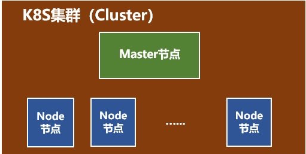
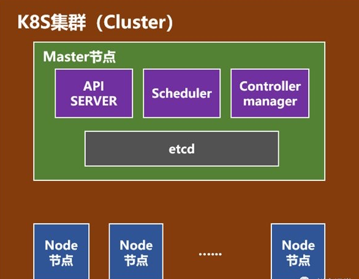
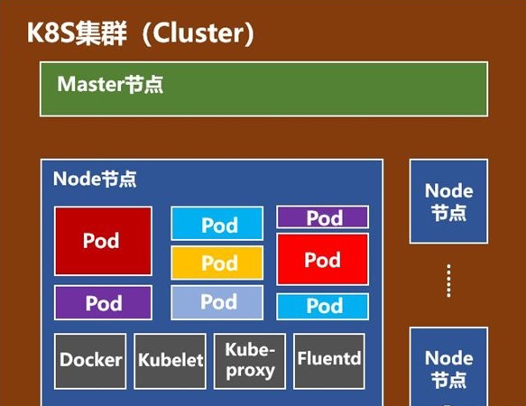
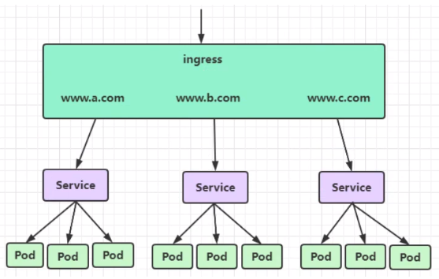
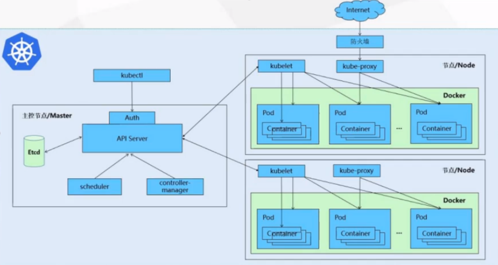

k8s的概念：对容器的进行管理和编排的平台。它是Google的Borg系统演进而来的开源版本。K8S是2014年开源的。

k8s系统通常以集群的主从形式搭建，一主多从。包含两个部分，一个Master节点和多个Node节点。





+ Master节点包括API Server、Scheduler、Controller manager、etcd。
  + API Server是整个系统的对外接口，供客户端和其它组件调用，是统一入口。
  + Scheduler负责对集群内部的资源进行调度，比如新创建的pod放在哪个Node上。
  + Controller manager负责管理控制器，负责集群内的Node、Pod副本、服务端点（Endpoint）、命名空间（Namespace）、服务账号（ServiceAccount）、资源定额（ResourceQuota）的管理。比如当某个Node意外宕机时，Controller Manager会及时发现并执行自动化修复流程，确保集群始终处于预期的工作状态。
  + etcd 分布k-v存储系统，用于保存集群状态数据，比如Pod，Service等对象信息



+ Node节点包括Docker、kubelet、kube-proxy、Fluentd、kube-dns（可选），还有就是**Pod**。
  + Pod是Kubernetes最基本的操作单元。一个Pod代表着集群中运行的一个进程，它内部封装了一个或多个紧密相关的容器。除了Pod之外，K8S还有一个Service的概念，一个Service可以看作一组提供相同服务的Pod的对外访问接口。
  + Docker，不用说了，创建容器的。
  + Kubelet，主要负责监视指派到它所在Node上的Pod，包括创建、修改、监控、删除等。
  + Kube-proxy，主要负责为Pod对象提供代理。
  + Fluentd，主要负责日志收集、存储与查询。

```bash
# 查看所有k8s系统的 pod 节点信息
$ kubectl get pods -n kube-system
$ kubectl get pods -n kubernetes-dashboard
$ kubectl get namespace  #查看命名空间

# 进入 pod
$ kubectl  get  pod  # 查看pod-name
$ kubectl exec -ti pod-name  -- /bin/sh

# 进入docker容器，也是类似操作：
$ docker ps  # 查看container-name
$ docker exec -ti container-name /bin/sh
```

暴露应用的三种方式

#### 1、NodePort暴露端口

三类端口：

+ nodePort 外部可以访问的端口，根据IP:Port可以访问服务。需要配置为type=NodePort

+ targetPort 容器端口，dockerfile EXPOSE制作容器填写的端口，例如docker.io官方的nginx暴露的是80端口。

+ port 集群内各个服务之间访问的端口，内部通讯使用。

  ```bash
  # 默认nodePort随机端口
  kubectl expose deployment nginx --port=80 --targetPort=80 --type=NodePort
  ```

#### 2、LoadBalancer

负载均衡器，type=LoadBalancer

#### 3、Ingress 暴露服务



生产使用，相当于一个集群网关。

[k8s安装部署](https://blog.csdn.net/qq_15018101/article/details/109387746)




+ **Deployment负责控制Pod的生命周期、保证服务有一定数量的Pod在运行。**Deployment定义了Pod内容，包括Pod数量、更新方式、使用的镜像，资源限制等等。

+ **Pod是Kubernetes部署实例时的最小单元。**一个Pod里面可以包含一个或者多个容器。

+ **Service对外暴露服务，是一个抽象概念，通过service来访问服务，我们就不需要关系pod增减个数等等。**